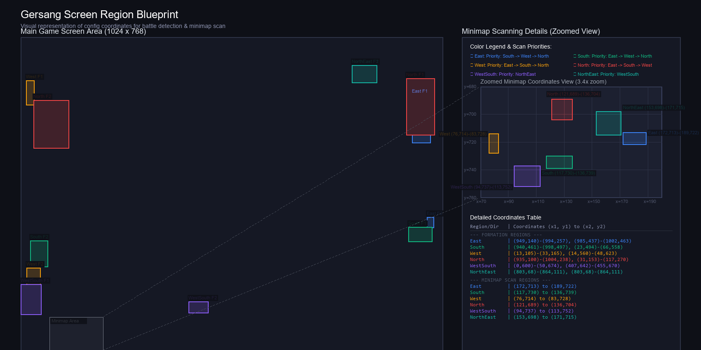

# Gersang Screen Region Configurations (1024x768)

Here is a visual map showing the exact locations of the configuration coordinates defined in [config.py](file:///c:/Users/rd/Documents/exploration/test/project/Battle/Nytheris/ikan_tol/config.py#L11-L27).

## 🗺️ Visual Map of Regions

---

## 📐 Detailed Breakdown of Coordinates

### 1. `FORMATION_REGIONS`
The script checks these regions (two coordinates per direction) to detect which direction the battle screen is currently facing.

*   **🟦 East**
    *   Region 1: `(949, 140) to (994, 257)` (Top-Right edge)
    *   Region 2: `(985, 437) to (1002, 463)` (Right-Middle edge)
*   **🟩 South**
    *   Region 1: `(940, 461) to (998, 497)` (Bottom-Right edge)
    *   Region 2: `(23, 494) to (66, 558)` (Bottom-Left edge)
*   **🟧 West**
    *   Region 1: `(13, 105) to (33, 165)` (Top-Left edge)
    *   Region 2: `(14, 560) to (48, 623)` (Bottom-Left edge)
*   **🟥 North**
    *   Region 1: `(935, 100) to (1004, 238)` (Top-Right edge)
    *   Region 2: `(31, 153) to (117, 270)` (Top-Left edge)
*   **🟪 WestSouth**
    *   Region 1: `(0, 600) to (50, 674)` (Bottom-Left area)
    *   Region 2: `(407, 642) to (455, 670)` (Bottom-Left area)
*   **🌐 NorthEast**
    *   Region 1: `(803, 68) to (864, 111)` (Top-Right area)
    *   Region 2: `(803, 68) to (864, 111)` (Top-Right area)

---

### 2. `MONSTER_DIRECTION_REGIONS` (Minimap check)
These are **very small** regions on the **minimap** (located in the bottom corners of the screen) used to detect where monsters are relative to your current location.

*   **🟦 East**: `(172, 713) to (189, 722)`
*   **🟩 South**: `(117, 730) to (136, 739)`
*   **🟧 West**: `(76, 714) to (83, 728)`
*   **🟥 North**: `(121, 689) to (136, 704)`
*   **🟪 WestSouth**: `(94, 737) to (113, 752)` *(Purple Region)*
*   **🌐 NorthEast**: `(153, 698) to (171, 715)` *(Teal Region - shifted another 5px up)*

---

### 3. `MONSTER_CHECKS` (Direction Scan Priority)
Once the script detects a battle formation, it knows which direction your team is facing. It then uses this dictionary to scan the *other* directions for monsters in priority order.

*   If facing **East** 🟦: Scan **South**, then **West**, then **North**.
*   If facing **South** 🟩: Scan **East**, then **West**, then **North**.
*   If facing **West** 🟧: Scan **East**, then **South**, then **North**.
*   If facing **North** 🟥: Scan **East**, then **South**, then **West**.
*   If facing **WestSouth** 🟪: Scan **NorthEast**.
*   If facing **NorthEast** 🌐: Scan **WestSouth**.
